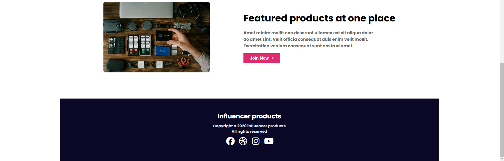

# Influencer Gear

A responsive HTML and CSS project showcasing a web design for influencer-related gear. This project focuses on clean design principles and modern web aesthetics, ideal for portfolios or promotional pages.

## Table of Contents

- [Introduction](#introduction)
- [Features](#features)
- [Installation](#installation)
- [Usage](#usage)
- [Screenshots](#screenshots)
- [Contributors](#contributors)
- [License](#license)

## Introduction

**Influencer Gear** is a static web project aimed at presenting a visually appealing design. It utilizes HTML for structure and CSS for styling, offering a sleek and user-friendly interface.

## Features

- Responsive design for all screen sizes
- Modern and minimalist aesthetics
- Easy-to-customize codebase

## Installation

1. Clone the repository:
   ```bash
   git clone https://github.com/sazid0411/influencer-gear.git

## Screenshots





